# Smart Café Ordering & Table Management System – Mobile App

This repository contains the **mobile application** of the *Smart Café Ordering & Table Management System*, developed during a hackathon held in Azerbaijan on the 13th of this month.

🏆 Our team **Full-Scope** (6 members) achieved **1st place** in the hackathon.

Unlike the web version, this mobile app focuses on **customer-side interactions** such as browsing the menu, creating orders, and making table reservations.

## 📱 Mobile App Overview

The mobile application was built with **Flutter**. Due to limited hackathon time, **Provider** was used for state management while still aiming to follow **Clean Architecture principles** as much as possible.

Key highlights:

* Dynamic **theme switching** (light / dark)
* Dynamic **language selection**
* Modular structure inspired by Clean Architecture

## 🎯 Purpose of the Mobile App

This mobile application allows customers to:

* View available menu items
* Create food orders directly from the menu
* Reserve tables for a specific date and time

> ⚠️ Note: This functionality differs from the web app, which mainly targets admin and waiter workflows.

## ✨ Features

* Menu browsing with categories
* Order creation (menu → quantity → confirmation)
* Table reservation by date
* Order history view
* Dynamic theme support
* Multi-language support

## 🧱 Architecture

The mobile application follows a **Feature-Based MVVM (Model–View–ViewModel) architecture**.

This approach organizes the project by **features** rather than layers, while still keeping responsibilities clearly separated:

* **View** – UI screens and widgets
* **ViewModel** – State management & business logic (Provider)
* **Model** – Data models and DTOs
* **Service** – API calls and external data sources

Each feature (e.g. menu, order, reservation) contains its own View, ViewModel, Model, and Service folders, improving scalability and readability.

Due to hackathon time constraints, the architecture is pragmatic rather than strictly enforced, but MVVM and feature-based separation principles were applied.

## 📸 Screenshots

  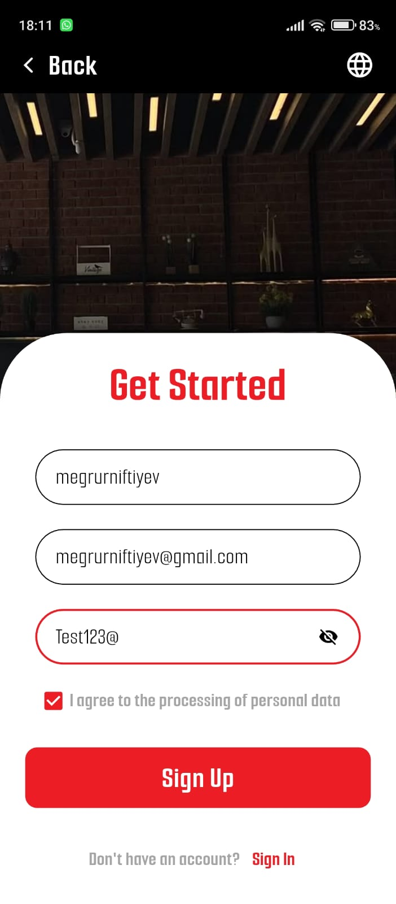
  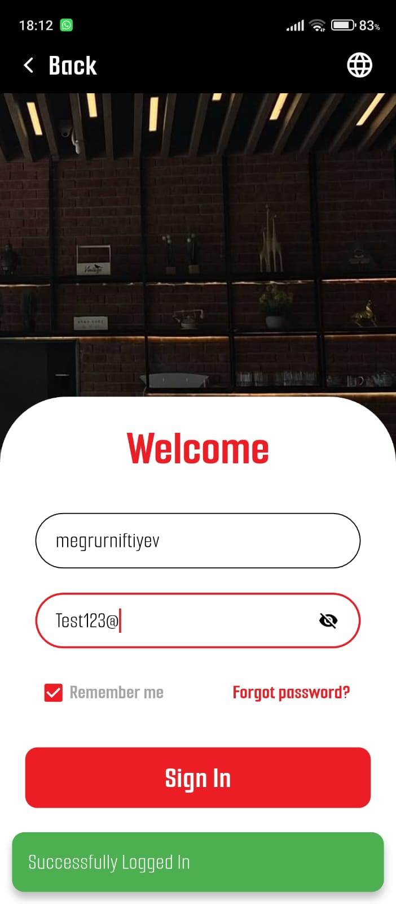
  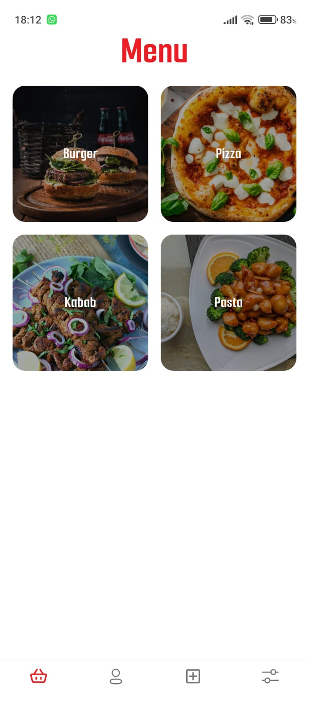
  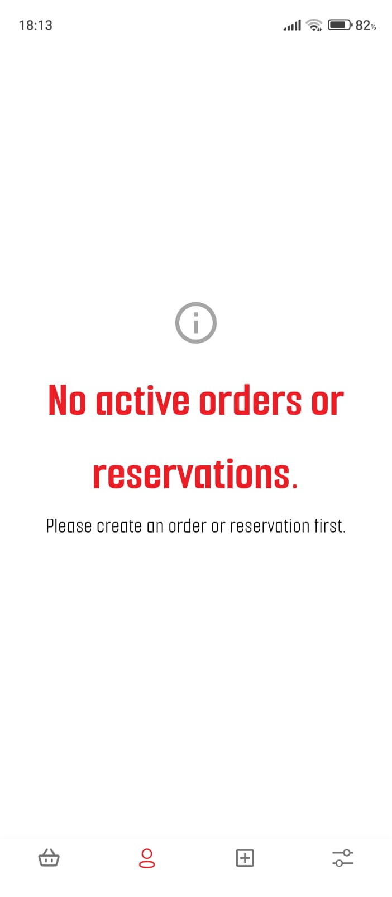  
  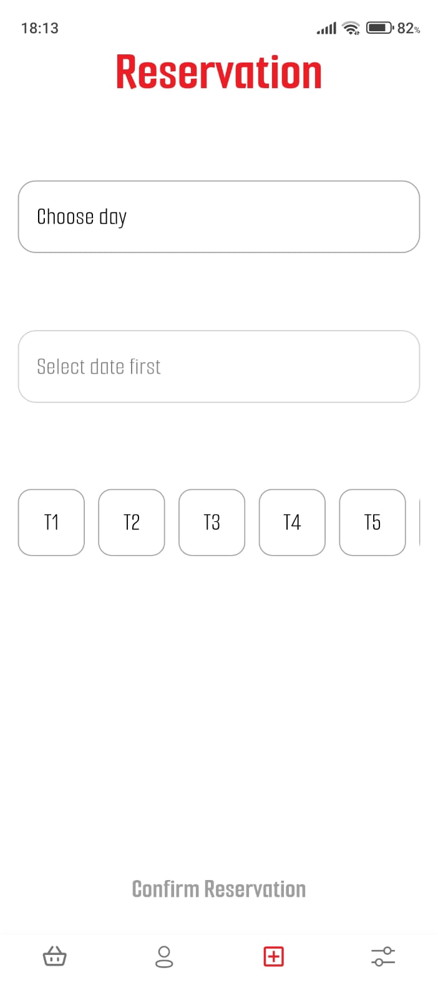
  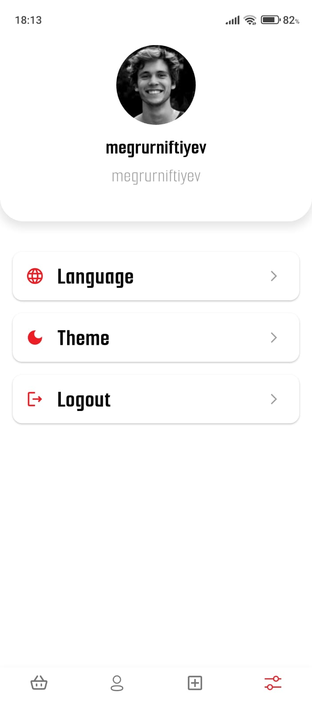
  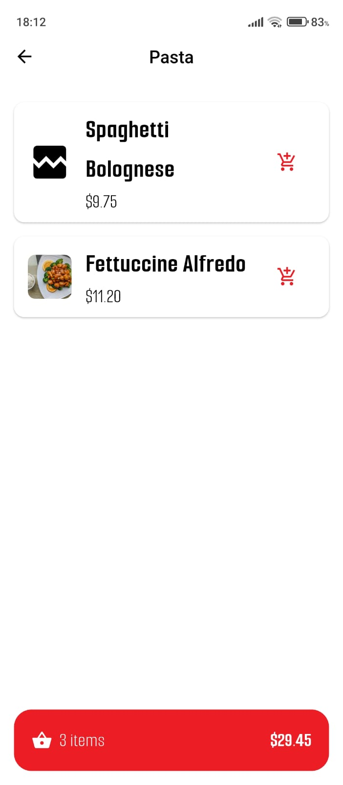
  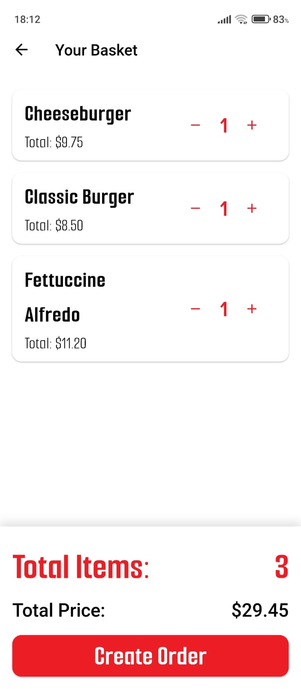
  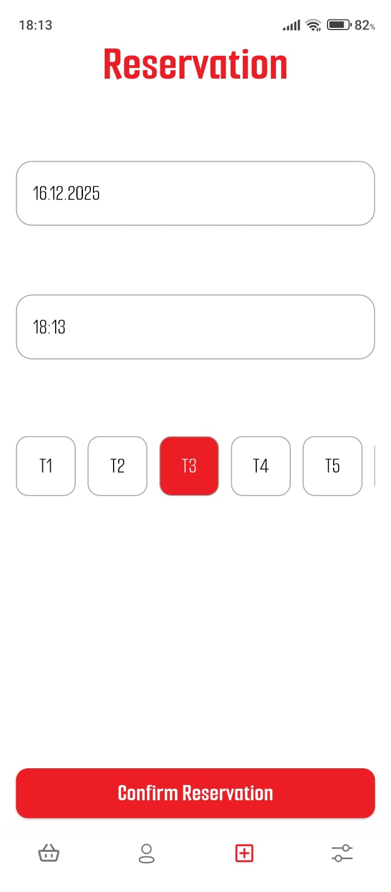
  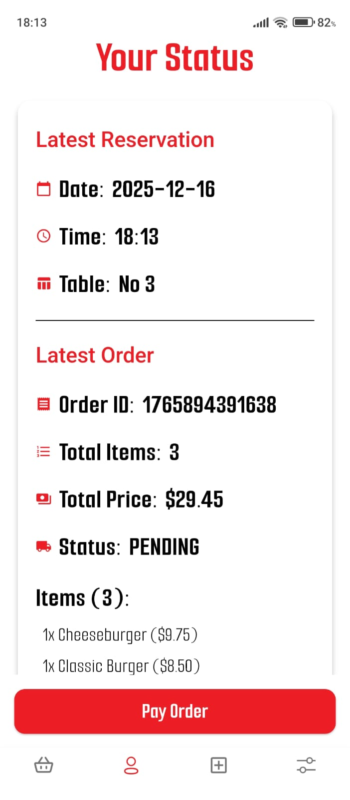
  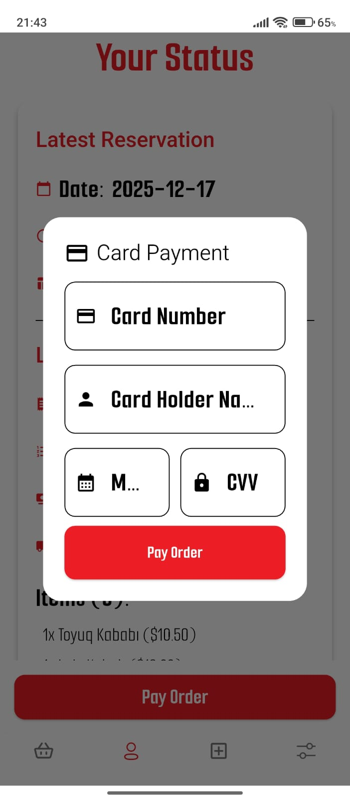 
  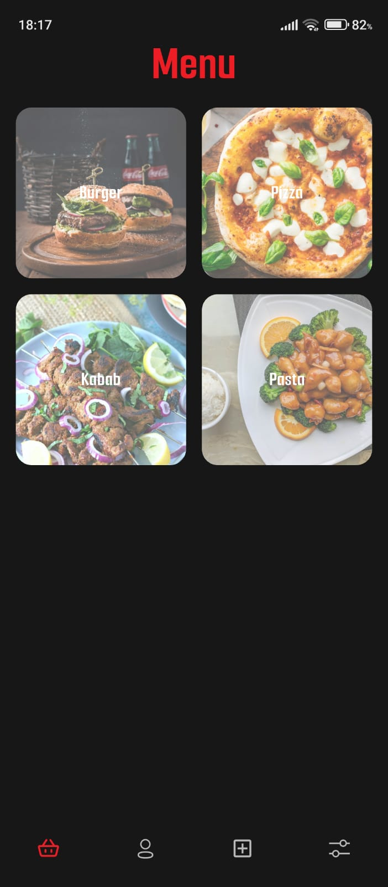 
  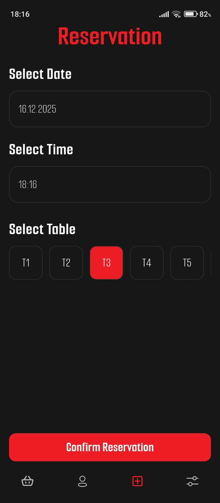 
  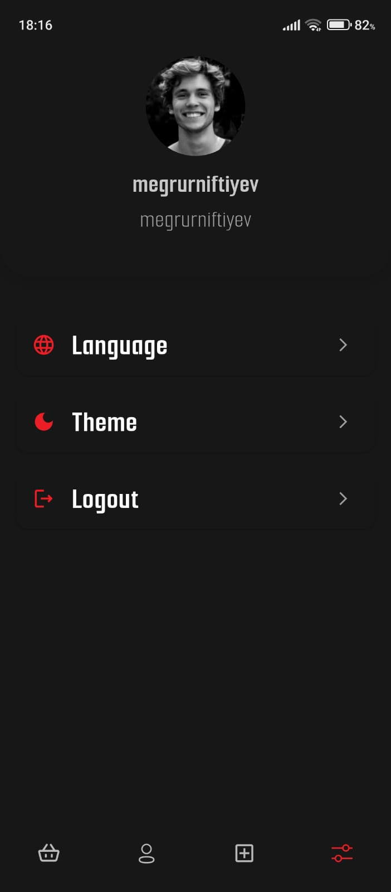

## 🛠️ Technologies Used

* **Flutter**
* **Provider** (State Management)
* REST API integration
* Dynamic theming
* Localization (multi-language support)

## 🔗 Related Repositories

* **📱 Mobile App (Flutter):** [https://github.com/CodeByQafar/hackathon_mobile](https://github.com/CodeByQafar/hackathon_mobile)
* **🌐 Web App (React):** [https://github.com/CodeByQafar/hackathon_front](https://github.com/CodeByQafar/hackathon_front)

### Web Application Overview

The web application is developed using **React** and **Redux Toolkit**. It is primarily designed for **admin and waiter workflows**, including:

* Menu management
* Table management
* Order tracking and status updates
* Role-based access control (Admin / Waiter / Customer)

The web and mobile applications share the same backend and business rules but are optimized for different user experiences.

## 🏆 Hackathon Result

The project was evaluated based on:

* Backend quality
* Frontend & mobile functionality
* Team collaboration
* Final presentation

Thanks to effective teamwork and clear system design, **Team Full-Scope** secured **1st place** 🏆.

## 📬 Contact

For questions or feedback:

📧 **[megrurniftiyev@gmail.com](mailto:megrurniftiyev@gmail.com)**
